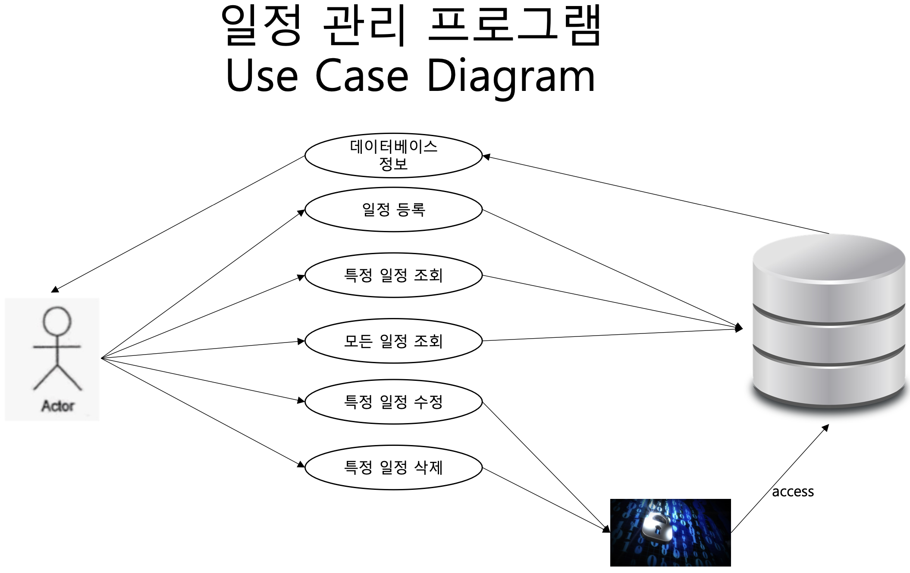
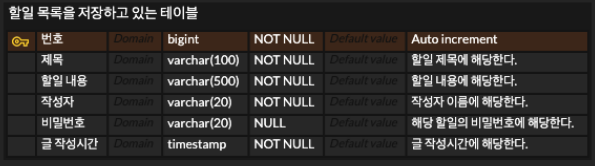

# TodoList 할일 목록 프로젝트
## Spring MVC패턴과 3 Layer Architecture, CRUD 구현 연습을 위한 프로젝트
---
## 기술 스택
+ Spring boot 3.2.2
+ JDK 17
+ Lombok
+ MySqL
---
## 기능
1. 일정 등록
2. 특정 일정 조회
3. 모든 일정 조회
4. 특정 일정 수정 - 비밀번호를을 이용하여 일치 시 수행
5. 특정 일정 삭제 - 비밀번호를을 이용하여 일치 시 수행
---
## Use Case Diagram

---
## API 명세서
| 기능 | Method | URL | Request Param | Request Body| Response Body |
|:---:|:---:|:---:|:---:|:---:|:---:|
| 등록 | POST | /api/todo/create | - | {'title':title,  'contents':contents,  'writer':writer,  'password':password} | 'id':id  'title':title,  'contents':contents,  'writer':writer,  'localDateTime':localDateTime}|
| 특정 일정 조회 | GET | /api/todo/read | ?'id'=id| - | 'id':id  'title':title,  'contents':contents,  'writer':writer,  'localDateTime':localDateTime}|
| 모든 일정 조회 | GET | /api/todo/readAll| - | - | 'id':id  'title':title,  'contents':contents,  'writer':writer,  'localDateTime':localDateTime} {...}|
| 특정 일정 수정 | PUT | /api/todo/update | ?'id'=id&'password'=password| 'title':title,  'contents':contents,  'writer':writer,  'password':password} | 'id':id  'title':title,  'contents':contents,  'writer':writer,  'localDateTime':localDateTime}|
| 특정 일정 삭제 | DELETE | /api/todo/delete | ?'id'=id&'password'=password| - | 'id':id  'title':title,  'contents':contents,  'writer':writer,  'localDateTime':localDateTime}|
---
## ERD

